# OneStop - 一站式电商平台系统

## 项目简介
OneStop是一个基于Spring Boot和Vue.js开发的一站式电商平台系统，提供完整的电商解决方案，包括用户购物、商家管理、管理员后台等功能模块。系统支持多角色权限管理，具备商品浏览、搜索、购物车、订单管理、支付等核心电商功能。

## 系统架构

### 前端架构
- **框架**：Vue 2.x
- **路由管理**：Vue Router 3.x
- **UI组件库**：Element UI
- **HTTP请求**：Axios
- **富文本编辑器**：wangEditor
- **动画效果**：animejs

### 后端架构
- **框架**：Spring Boot 2.5.9
- **ORM框架**：MyBatis
- **数据库**：MySQL 8.0+
- **认证授权**：JWT (JSON Web Token)
- **对象存储**：MinIO 8.5.10
- **缓存**：Caffeine
- **分页插件**：PageHelper
- **API文档**：Swagger 3.0.0
- **工具库**：Hutool
- **数据库迁移**：Flyway

## 功能模块

### 1. 用户模块
- 用户注册与登录
- 个人信息管理
- 地址管理
- 密码修改

### 2. 商品模块
- 商品浏览与搜索
- 商品分类展示
- 商品详情查看
- 商品评论与评分

### 3. 购物车模块
- 添加商品到购物车
- 修改购物车商品数量
- 从购物车删除商品
- 购物车结算

### 4. 订单模块
- 创建订单
- 订单状态管理
- 订单历史查询
- 订单详情查看

### 5. 收藏模块
- 商品收藏
- 收藏管理

### 6. 商家模块
- 商家注册与审核
- 商家信息管理
- 商品管理（添加、修改、删除）
- 订单管理

### 7. 管理员模块
- 用户管理
- 商家管理与审核
- 商品管理
- 订单管理
- 评论管理
- 分类管理
- 公告管理

## 数据库设计
系统包含以下主要数据表：
- `user` - 用户信息表
- `admin` - 管理员信息表
- `business` - 商家信息表
- `goods` - 商品信息表
- `type` - 商品分类表
- `orders` - 订单信息表
- `cart` - 购物车表
- `collect` - 收藏信息表
- `comment` - 评论信息表
- `address` - 地址信息表
- `notice` - 公告信息表

## 部署指南

### 环境要求
- JDK 17+
- MySQL 8.0+
- Node.js 14+
- Maven 3.6+
- MinIO服务器（用于文件存储）

### MinIO配置（文件存储服务）
1. 下载MinIO服务器
   从[MinIO官网](https://min.io/download)下载适合您操作系统的MinIO服务器

2. 启动MinIO服务
   ```bash
   # Windows系统
   minio.exe server D:\Program Files\Minio\minio-data --console-address ":9001"
   
   # Linux/Mac系统
   ./minio server /path/to/minio-data --console-address ":9001"
   ```

3. 配置MinIO
   - 访问MinIO控制台：`http://localhost:9001`
   - 使用默认凭证登录：minioadmin/minioadmin（建议首次登录后修改密码）
   - 创建名为`files`的存储桶
   - 将存储桶的访问策略设置为`public`（允许公共访问文件）

### 后端部署
1. 克隆项目到本地
   ```bash
   git clone [项目地址]
   cd OneStop/springboot
   ```

2. 导入数据库脚本
   ```bash
   mysql -u root -p < ../OneStop.sql
   ```

3. 配置应用参数
   - 修改 `src/main/resources/application.yml` 中的数据库连接信息
   - 配置MinIO连接信息（地址、访问密钥、密钥等）

4. 构建并运行项目
   ```bash
   mvn clean package
   java -jar target/springboot-0.0.1-SNAPSHOT.jar
   ```

### 前端部署
1. 进入前端目录
   ```bash
   cd ../vue
   ```

2. 安装依赖
   ```bash
   npm install
   ```

3. 开发环境运行
   ```bash
   npm run serve
   ```

4. 生产环境构建
   ```bash
   npm run build
   ```
   构建后的文件在 `dist` 目录，可部署到Nginx等Web服务器

### 系统访问
- 前端访问地址：`http://localhost:8080`
- 管理员登录地址：`http://localhost:8080/login`
- 默认管理员账号：admin / admin

## 系统截图
以下是系统各主要功能模块的界面截图：

### 首页展示


### 用户与登录
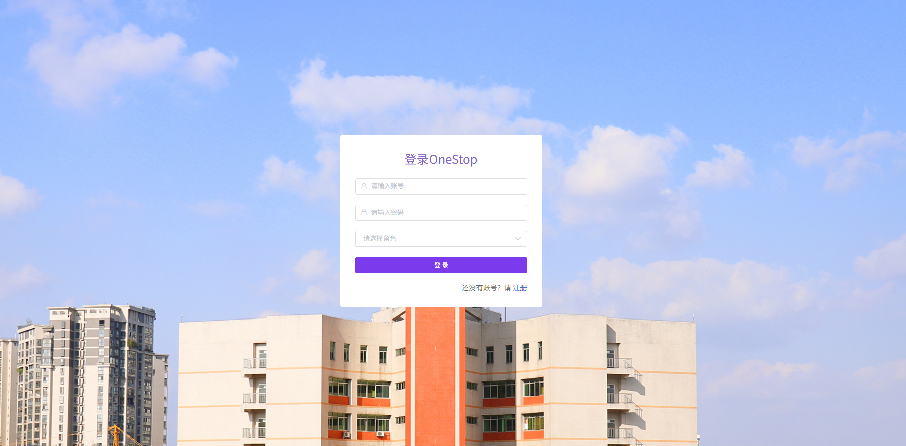


### 商品模块

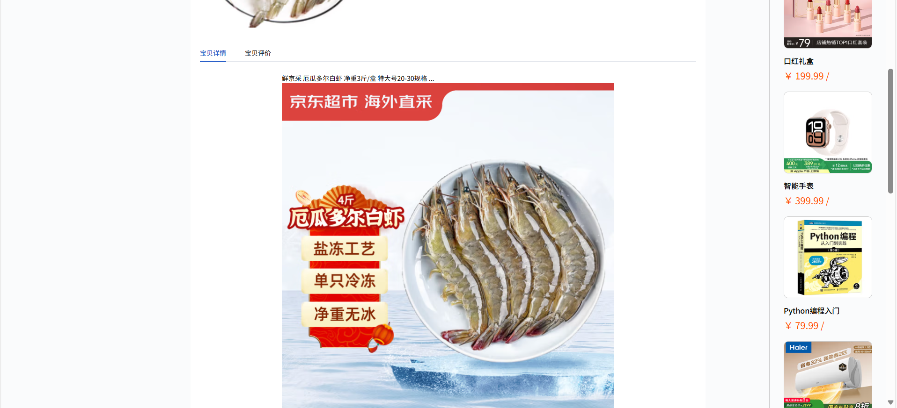


### 购物车与订单


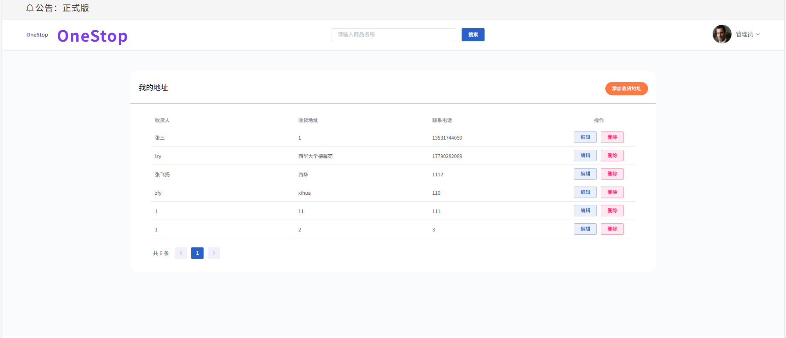
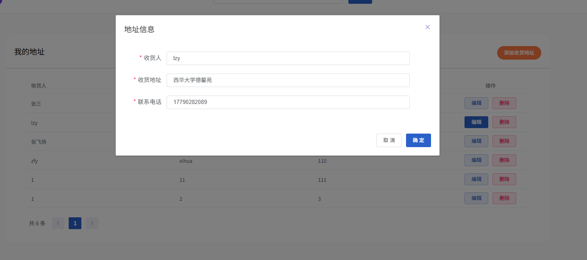

### 个人中心
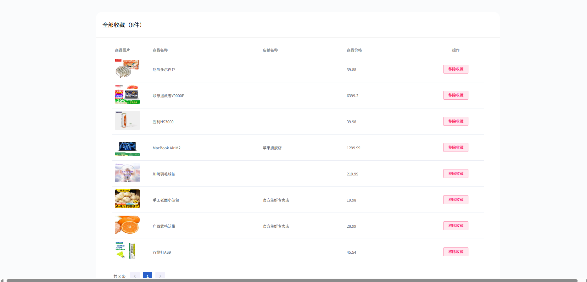

### 商家店铺


### 管理员后台
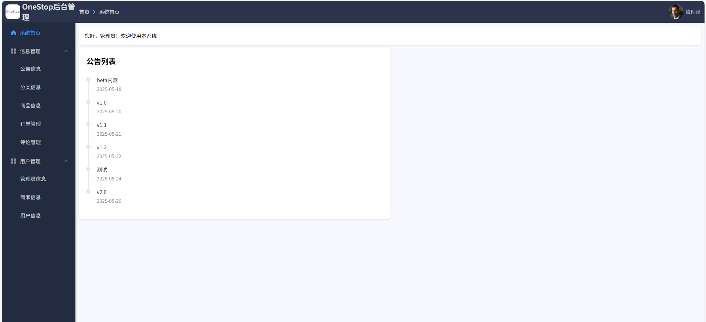
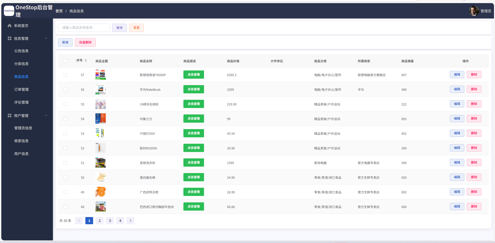
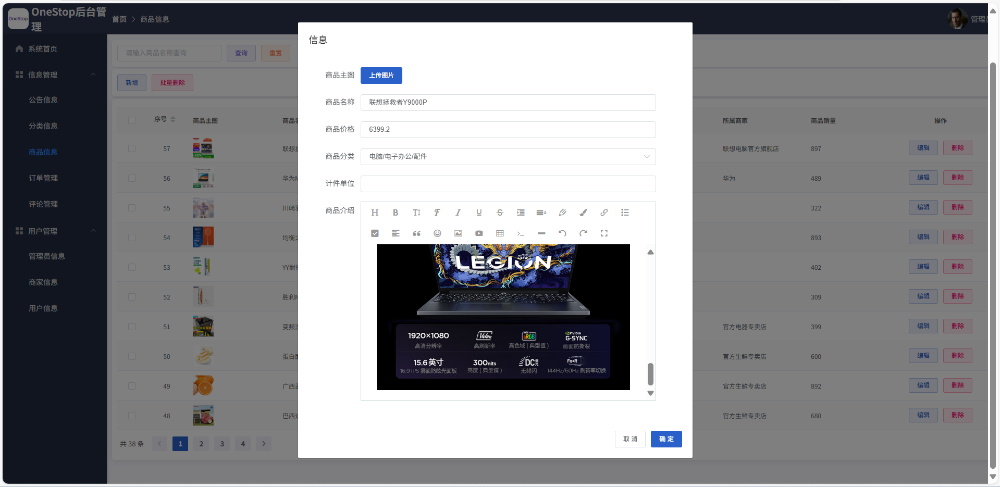


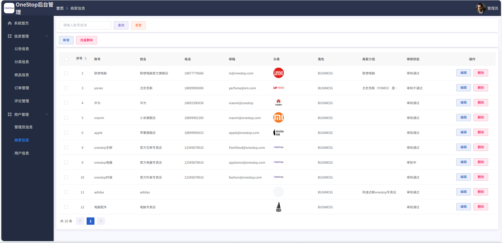

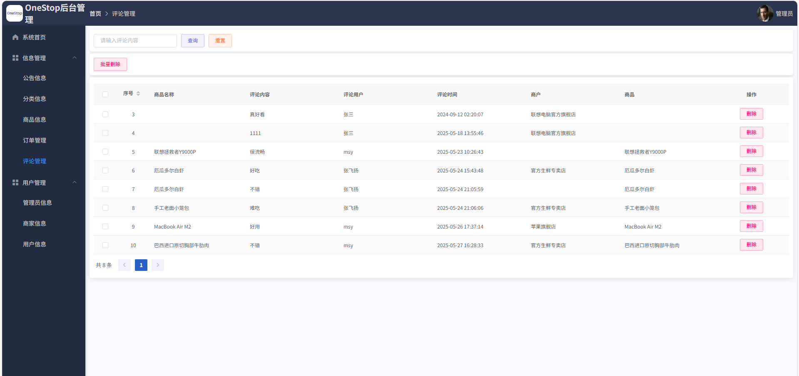

### MinIO文件管理
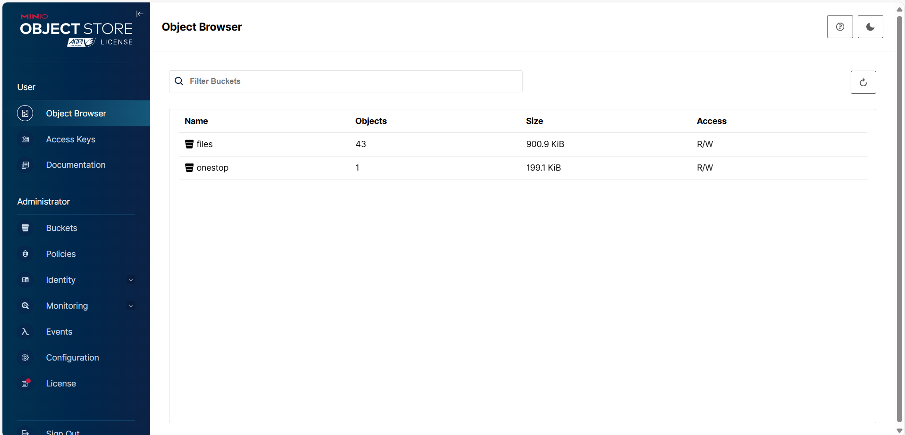
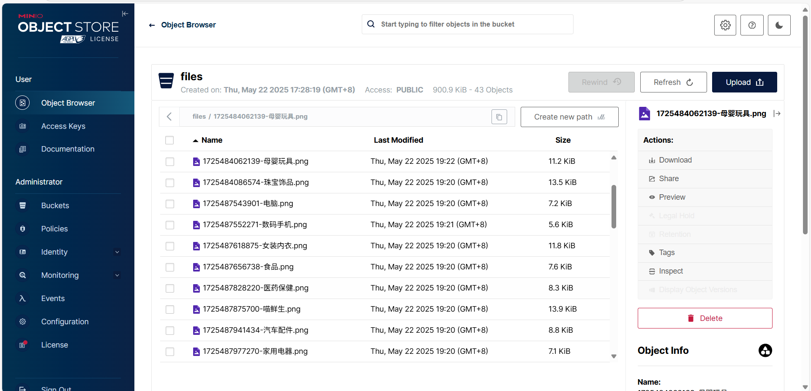

## 许可证
[MIT License](LICENSE)

## 联系方式
如有问题或建议，请联系项目开发团队。

